# pixel_of_shields 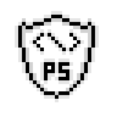

Repositório de escudos de frameworks, linguagens, plataformas e tecnologias em geral feitas com pixel art.

<h1 align="center">
    
</h1>

  <a href="#clipboard-Base">Shields Base</a>&nbsp;&nbsp;&nbsp;|&nbsp;&nbsp;&nbsp;
  <a href="#clipboard-Dark">Shields Dark</a>&nbsp;&nbsp;&nbsp;|&nbsp;&nbsp;&nbsp;
  <a href="#memo-licença">Licença</a>

 

## :clipboard: Lista de ícones

### :clipboard: Base

|                                       Ícone                                      |    Referência    | Classificação |
| :------------------------------------------------------------------------------: | :--------------: | :-----------: |
| 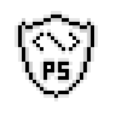          | Pixel of Shields |     Base      |
| 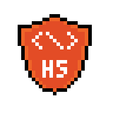                |      HTML5       |     Base      |
| 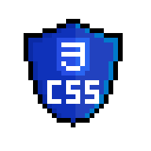                   |       CSS3       |     Base      |
| 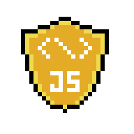|    JavaScript    |     Base      |
| 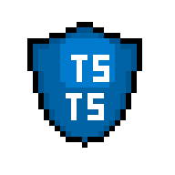|    TypeScript    |     Base      |
| 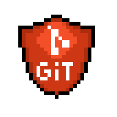                     |        Git       |     Base      |
| 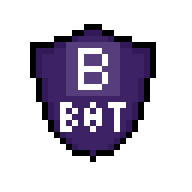   |     Bootstrap    |     Base      |
| 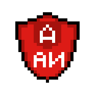         |      Angular     |     Base      |
| 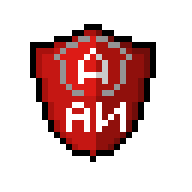   |     AngularJS    |     Base      |
| 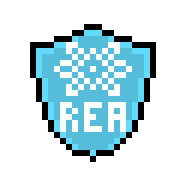               |       React      |     Base      |
| 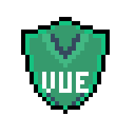                     |        Vue       |     Base      |
| 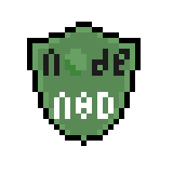                  |       Node       |     Base      |
|                      |        Php       |     Base      |
| 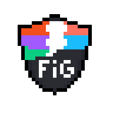               |       Figma      |     Base      |
| 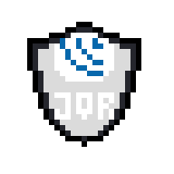            |      Jquery      |     Base      |
|                      |        NPM       |     Base      |
| 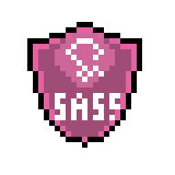                  |       SASS       |     Base      |
| 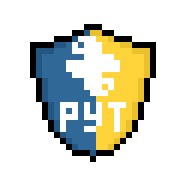            |      Python      |     Base      |
| 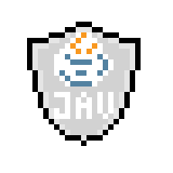                  |      Java        |     Base      |
| 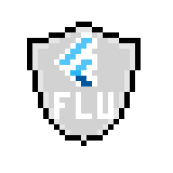         |      Flutter     |     Base      |
| 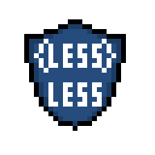                  |       LESS       |     Base      |
| 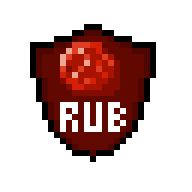                  |       Ruby       |     Base      |
|                       |        C#        |     Base      |
|                  |        C++       |     Base      |
| 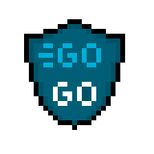                        |        Go        |     Base      |
| 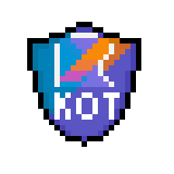            |      Kotlin      |     Base      |
| 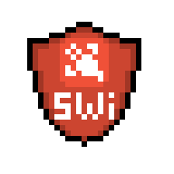               |       Swift      |     Base      |
|                |       Flask      |     Base      |

### :clipboard: Dark

|                                        Ícone                                          |    Referência    | Classificação |
| :-----------------------------------------------------------------------------------: | :--------------: | :-----------: |
| 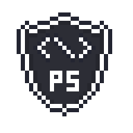          | Pixel of Shields |     Dark      |
| 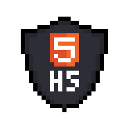                |      HTML5       |     Dark      |
| 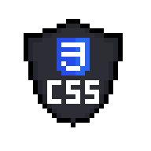                   |       CSS3       |     Dark      |
| 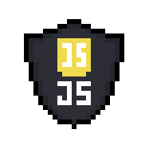|    JavaScript    |     Dark      |
| 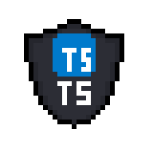|    TypeScript    |     Dark      |
| 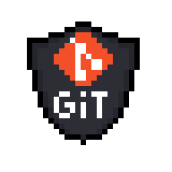                     |        Git       |     Dark      |
| 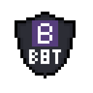   |     Bootstrap    |     Dark      |
| 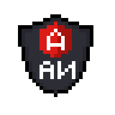         |      Angular     |     Dark      |
| 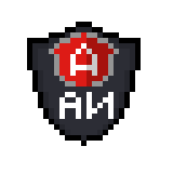   |     AngularJS    |     Dark      |
| 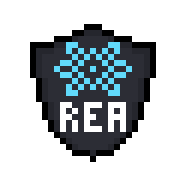               |       React      |     Dark      |
| 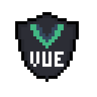                     |        Vue       |     Dark      |
| 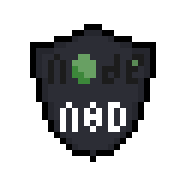                  |       Node       |     Dark      |
| 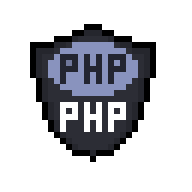                     |        Php       |     Dark      |
| 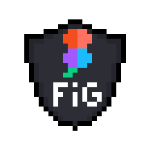               |       Figma      |     Dark      |
| 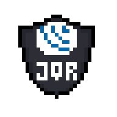            |      Jquery      |     Dark      |
| 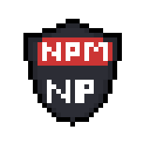                     |       NPM        |     Dark      |
| 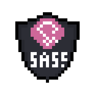                  |       SASS       |     Dark      |
|             |      Python      |     Dark      |
| 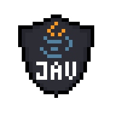                  |      Java        |     Dark      |
| 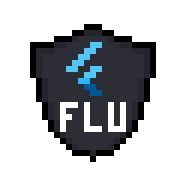         |      Flutter     |     Dark      |
| 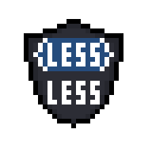                  |       LESS       |     Dark      |
|                   |       Ruby       |     Dark      |
|                       |        C#        |     Dark      |
|                  |        C++       |     Dark      |
| 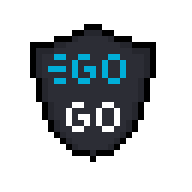                        |        Go        |     Dark      |
| 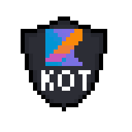            |      Kotlin      |     Dark      |
| 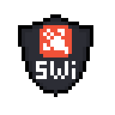               |       Swift      |     Dark      |
| 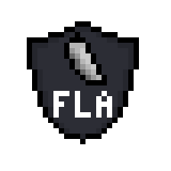               |       Flask      |     Dark      |

## :memo: Licença

Esse projeto está sob a licença Apache. Veja o arquivo [LICENSE](LICENSE) para mais detalhes.
