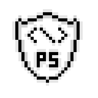
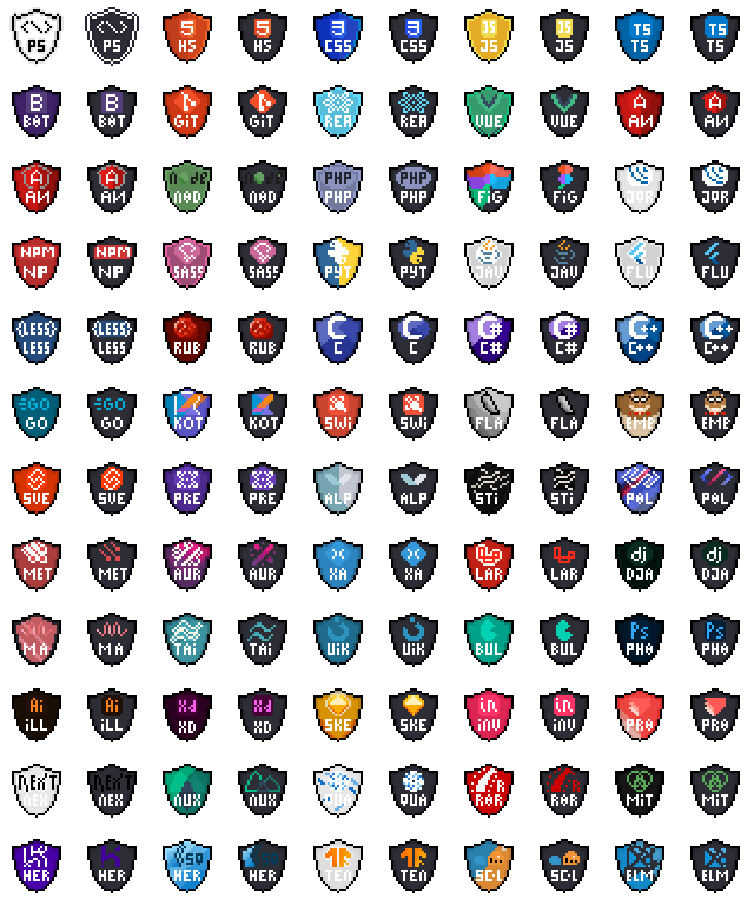
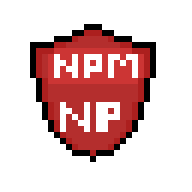

# pixel_of_shields 

Repositório de escudos de frameworks, linguagens, plataformas e tecnologias em geral feitas com pixel art.

<h1 align="center">
    
</h1>

    

  <a href="#white_circle-Base">Shields Base</a>&nbsp;&nbsp;&nbsp;|&nbsp;&nbsp;&nbsp;
  <a href="#black_circle-Dark">Shields Dark</a>&nbsp;&nbsp;&nbsp;|&nbsp;&nbsp;&nbsp;

 

## :clipboard: Lista de ícones

### :white_circle: Base

|                                       Ícone                                         |    Referência    | Classificação |
| :---------------------------------------------------------------------------------: | :--------------: | :-----------: |
|              | Pixel of Shields |     Base      |
|                    |      HTML5       |     Base      |
|                       |       CSS3       |     Base      |
|    |    JavaScript    |     Base      |
|    |    TypeScript    |     Base      |
|                         |        Git       |     Base      |
|       |     Bootstrap    |     Base      |
|             |      Angular     |     Base      |
|       |     AngularJS    |     Base      |
|                   |       React      |     Base      |
|                         |        Vue       |     Base      |
|                      |       Node       |     Base      |
|                         |        Php       |     Base      |
|                   |       Figma      |     Base      |
|                |      Jquery      |     Base      |
|                         |        NPM       |     Base      |
|                      |       SASS       |     Base      |
|                |      Python      |     Base      |
|                      |      Java        |     Base      |
|             |      Flutter     |     Base      |
|                      |       LESS       |     Base      |
|                      |       Ruby       |     Base      |
|                               |        C         |     Base      |
|                          |        C#        |     Base      |
|                     |        C++       |     Base      |
|                            |        Go        |     Base      |
|                |      Kotlin      |     Base      |
|                   |       Swift      |     Base      |
|                   |       Flask      |     Base      |
|                   |       Ember      |     Base      |
|                |       Svelte     |     Base      |
|                |       Preact     |     Base      |
|              |      Alpinejs    |     Base      |
|          |      Stimulus    |     Base      |
|    |     LitElement   |     Base      |
|                |       METEOR     |     Base      |
|             |       Aurelia    |     Base      |
|             |       Xamarin    |     Base      |
|             |       Laravel    |     Base      |
|                |       Django     |     Base      |
| |     Materialize  |     Base      |
|          |      Tailwind    |     Base      |
|                |       UI Kit     |     Base      |
|                   |       Bulma      |     Base      |

### :black_circle: Dark

|                                        Ícone                                             |    Referência    | Classificação |
| :--------------------------------------------------------------------------------------: | :--------------: | :-----------: |
|              | Pixel of Shields |     Dark      |
|                    |      HTML5       |     Dark      |
|                       |       CSS3       |     Dark      |
|    |    JavaScript    |     Dark      |
|    |    TypeScript    |     Dark      |
|                         |        Git       |     Dark      |
|       |     Bootstrap    |     Dark      |
|             |      Angular     |     Dark      |
|       |     AngularJS    |     Dark      |
|                   |       React      |     Dark      |
|                         |        Vue       |     Dark      |
|                      |       Node       |     Dark      |
|                         |        Php       |     Dark      |
|                   |       Figma      |     Dark      |
|                |      Jquery      |     Dark      |
|                         |       NPM        |     Dark      |
|                      |       SASS       |     Dark      |
|                |      Python      |     Dark      |
|                      |      Java        |     Dark      |
|             |      Flutter     |     Dark      |
|                      |       LESS       |     Dark      |
|                      |       Ruby       |     Dark      |
|                               |        C         |     Dark      |
|                          |        C#        |     Dark      |
|                     |        C++       |     Dark      |
|                            |        Go        |     Dark      |
|                |      Kotlin      |     Dark      |
|                   |       Swift      |     Dark      |
|                   |       Flask      |     Dark      |
|                   |       Ember      |     Dark      |
|                |       Svelte     |     Dark      |
|                |       Preact     |     Dark      |
|              |      Alpinejs    |     Dark      |
|          |      Stimulus    |     Dark      |
|    |     LitElement   |     Dark      |
|                |       METEOR     |     Dark      |
|             |       Aurelia    |     Dark      |
|             |       Xamarin    |     Dark      |
|             |       Laravel    |     Dark      |
|                |       Django     |     Dark      |
| |     Materialize  |     Dark      |
|          |      Tailwind    |     Dark      |
|                |       UI Kit     |     Dark      |
|                   |       Bulma      |     Dark      |
